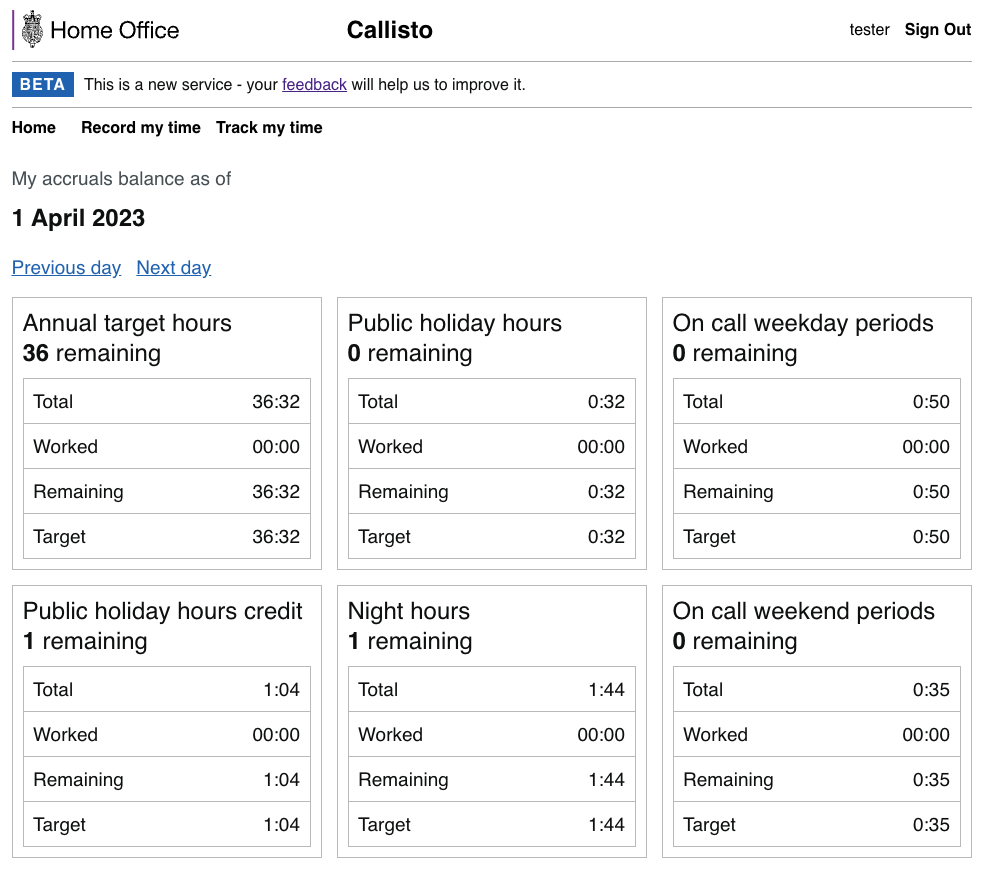

# Accruals

The accruals screen allow the user to see how many hours they have accrued against their agreements and targets.
The easiest way to see the accruals screens working is to use the [postman collection](https://github.com/UKHomeOffice/callisto-postman-collections) to insert and remove the data.

Each user should have one agreement per period, most likely one per month. They should then have an agreement target for that period for each of the individual accrual types. There should then be an accrual entry per day for each accrual type. In the partial example below we can see that the agreement covers the first week of April. The id of that agreement links to the agreementId of the matching agreement targets. There are then accruals for each of those types for the first and second of April.

## Screen data and layout

Currently the screen will dynamically add an accrual on each that it finds one lined to an agreement and target. Some of the accruals will have different requirements for populating the screen but currently we have Annual Target Hours, Night Hours and Weekend Hours that all follow this pattern:

| Field | Populated from |
|-------|----------------|
| Total | targetTotal from the agreement target record |
| Worked | cumulativeTotal from the accrual record |
| Remaining | Total - Worked |
| Target | Total - cumulativeTarget on the accrual record |
| Variable in title field | Remaining rounded down to the nearest hour |

All data is supplied by the API in minutes and the UI component will convert it into hours and minutes for display. Each accrual type has a display order so it can be easily reordered.

### Furure Work

When the accruals solution is fully implemented the importing of the agreement will automatically generate targets and accruals for every day it covers. That means that with the dynamic UI, every day would have 10 accruals displayed. It's highly unlikely that anyone will actually accrue all 10 types so matbe we sgould only display accruals that have accrued towards the target.